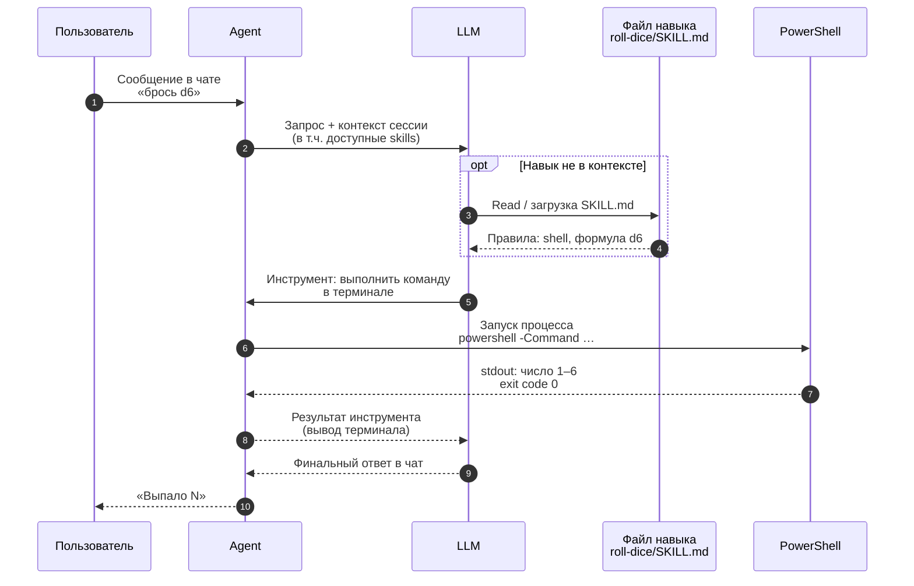

# Бросок кубика: sequence diagram

Кратко: пользователь просит бросок в чате Cursor. Агент (Composer) опирается на инструкции из `SKILL.md`, запускает команду в терминале, PowerShell возвращает число, ответ показывается в чате.

